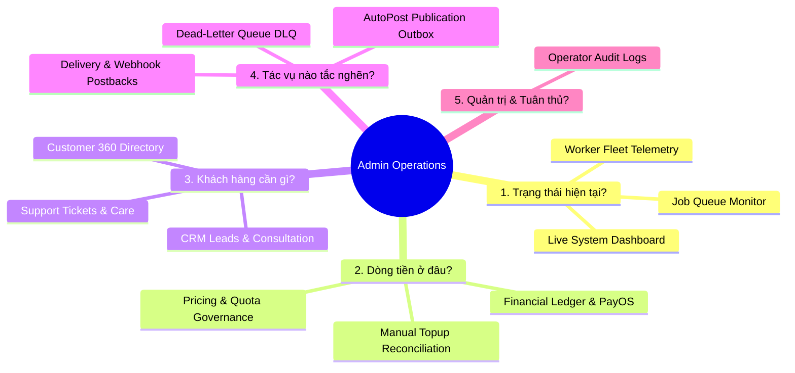

# Web App V3 Admin Architecture & Operating Model
> **Task**: `P0.WEBAPP.V3.AUDIT.CANONICAL.ARCHITECTURE.TRUTH.CLOSURE`
> **Program**: `P0.WEBAPP.FULL.PRODUCT.TRUTH.REMEDIATION.V1`
> **Repository**: `manhtoangreensky-wq/toan-aas-standalone`
> **Authoritative Base SHA**: `8873e10f2279aec0fb312b70388b9073ba763f13`
> **Governance**: `OWNER-GOVERNED`, `AUDIT_DOCUMENTATION_ONLY`, `NO_FEATURE_IMPLEMENTATION`

---

## 1. Operating Model & Governance Boundary

### 1.1 Governance Boundary: Product Control vs Production Gate (`INDEPENDENT_SOURCE_VERIFIED`)

A fundamental rule of the TOAN AAS ecosystem is the absolute separation between business operational controls and production safety gates:

```
+-------------------------------------------------------------------------------+
|                             ADMIN PRODUCT CONTROL                             |
|  Operational actions exposed via canonical adapters in the Admin Web UI:       |
|  - View customer 360 profile, active jobs, and transaction history            |
|  - Cancel stuck jobs or trigger scene retry via canonical worker claim        |
|  - Review and approve manual topup drafts with 3-layer reconciliation proofs   |
|  - Reply to customer support tickets and assign agents                        |
|  - Monitor live worker fleet telemetry and queue backlogs                     |
|  - Pause or retry publication attempts (publish-only, without rerunning video)|
+-------------------------------------------------------------------------------+
                                      ||
                     STRICT SECURITY AIR-GAP / BOUNDARY
                                      ||
+-------------------------------------------------------------------------------+
|                            OWNER PRODUCTION GATE                              |
|  PROHIBITED from the Admin Web UI — Requires Owner Terminal Authorization:    |
|  - NO raw database editor / arbitrary SQL query console                       |
|  - NO arbitrary wallet balance modifier without audited canonical adapter     |
|  - NO secret / environment variable (.env) editor                             |
|  - NO unbounded systemctl console or shell command execution                  |
|  - NO unverified external paid provider API calls                             |
+-------------------------------------------------------------------------------+
```

---

## 2. The 5 Core Operational Questions & 13 Admin Web Domains

Admin operations are structured around 5 core operational questions:



### 2.1 The 13 Canonical Admin Web Domains (`TARGET_DESIGN`)

1. **Live System Dashboard (`/admin`)**: Real-time service status, active users, queue depth, error rates.
2. **Customer 360 (`/admin/customers`)**: Unified customer profile linking account identity, verified wallet balance, job run history, support tickets, and Telegram pairing status.
3. **CRM Leads & Requests (`/admin/leads`)**: Enterprise lead capture, consulting requests, conversion status.
4. **Financial Ledger & Reconciliation (`/admin/finance`)**: PayOS webhook logs, topup volume, revenue breakdown.
5. **Manual Topup Operations (`/admin/topups`)**: 3-layer verification for manual bank transfers, draft approvals, and idempotent credit invocation via Bot Core bridge.
6. **Job Queue Monitor (`/admin/jobs`)**: Status tracking for video, voice, and audio jobs across their entire lifecycle.
7. **Dead-Letter Queue (DLQ) Recovery (`/admin/dlq`)**: Isolated failed tasks with error stack traces and single-click retry via canonical claim outbox.
8. **Worker Fleet Telemetry (`/admin/workers`)**: Status of systemd-managed Product Video workers on VPS (`tg.toanaas.vn`), claim heartbeats, and queue backlog depths (`services/remote_worker_api.py`).
9. **Catalog & Pricing Governance (`/admin/pricing`)**: Token pricing per model/second, SKU catalog management, and bridge synchronization.
10. **Delivery & Webhook Postbacks (`/admin/delivery`)**: Outbound platform postbacks, external API delivery receipts.
11. **AutoPost Publication Monitor (`/admin/publishing`)**: Scheduled social posts, platform attempt history, publication outbox states, and channel receipts.
12. **Operator Audit Logs (`/admin/audit`)**: Immutable chronological log of all administrator actions.
13. **Support Tickets (`/admin/tickets`)**: Integrated helpdesk for resolving customer inquiries and technical disputes.

---

## 3. Worker Fleet Telemetry & Integration Contract

### 3.1 Canonical Worker Fleet Architecture (`INDEPENDENT_SOURCE_VERIFIED`)
The Web Admin must monitor the existing canonical execution engine:
- Storage Authority: SQLite `video_jobs` table.
- Task Dispatch: `video_dispatch_outbox` table.
- Worker Protocol: Lease/claim mechanics managed by `services/remote_worker_api.py` and `remote_worker.py`.
- Execution Nodes: systemd-managed daemon workers executing on the production Ubuntu VPS.
- **Queue Note**: Celery and Redis are NOT currently used. All admin telemetry queries must read directly from the SQLite outbox and worker claim logs.

### 3.2 Admin Worker Actions (`TARGET_DESIGN`)
- **Inspect**: View active leases, claim expiration timestamps, and worker host identifiers.
- **Reclaim / Release**: If a worker node goes silent past its lease expiration, allow releasing the lease back to the outbox for re-claiming by healthy workers.
- **Fail Closed**: If a job fails definitively, record `FAILED_NO_CHARGE=0_XU` to ensure the customer is never charged.

---

## 4. Internal Mobile App Operating Architecture (Reference Media Analysis)

Based on empirical review of the reference media suite in `evidence/admin-internal-reference-20260827/` (`App nội bộ.mp4`, `app mẫu.mp4`, `bảng chức năng.png`):

### 4.1 Business Domain Alignment (`REFERENCE_MEDIA_OBSERVED`)
The 21 functional rows in `bảng chức năng.png` map into 5 primary mobile operational tabs:

```
+-------------------------------------------------------------------+
|                     INTERNAL MOBILE APP SHELL                     |
|                                                                   |
| [Tab 1: Trang chủ]   -> Real-time KPIs, Red Alerts, System Health |
| [Tab 2: Công việc]   -> Active Job Queue, DLQ Failures, Approvals |
| [Tab 3: Tạo nhanh]   -> Quick Actions (Grant Quota, Fast Ticket)  |
| [Tab 4: Nội bộ]      -> Operator Shifts, Tasks, Internal Handoffs |
| [Tab 5: Cá nhân]     -> Admin Account, Session Security, Settings |
+-------------------------------------------------------------------+
```

### 4.2 Mobile Interaction Guidelines (`TARGET_DESIGN`)
1. **Thumb-Friendly Bottom Navigation**: Fixed bottom navigation bar with 5 primary touch targets.
2. **Slide-In Detail Sheets**: Clicking any item opens an inspection sheet from the bottom (200–240ms ease-out) rather than full page transitions.
3. **No Unconstrained Gamification**: Particle animations, falling stars, or fake marketing badges are strictly excluded from the professional internal tool.
4. **Offline-Safe Read Cache**: Essential emergency contacts and service status cache locally to ensure availability during network drops.
