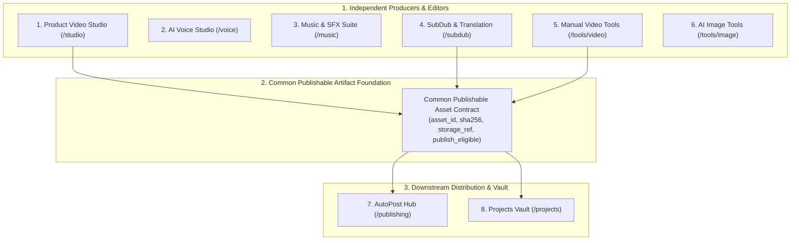

# Web App V3 Customer Information Architecture (IA) Specification
> **Task**: `P0.WEBAPP.V3.AUDIT.AUTOPOST.SINGLE.AUTHORITY.FINAL.ALIGNMENT`
> **Program**: `P0.WEBAPP.FULL.PRODUCT.TRUTH.REMEDIATION.V1`
> **Repository**: `manhtoangreensky-wq/toan-aas-standalone`
> **Authoritative Base SHA**: `8873e10f2279aec0fb312b70388b9073ba763f13`
> **Governance**: `OWNER-GOVERNED`, `AUDIT_DOCUMENTATION_ONLY`, `NO_FEATURE_IMPLEMENTATION`

---

## 1. Architectural Principles

The customer information architecture is redesigned to eliminate catalog flattening and align with the real commercial value proposition of TOAN AAS:

1. **Product-Centric Hierarchy (`TARGET_DESIGN`)**: Customers interact with high-level creative and business solutions, not raw technical subroutines.
2. **Distinct Product Family Separation (`TARGET_DESIGN`)**:
   - **Music & SFX** is strictly separated from **Subtitle/Dubbing/Translation**.
   - **Manual Video Tools (Video Edit)** is an independent utility engine that processes local/server media directly without invoking paid AI generative providers.
   - **Free Utilities** is a separate lead-magnet product family, not absorbed into Video Edit.
   - **AutoPost (Publishing Automation)** is a downstream control surface and read projection consuming canonical Bot AutoPost APIs; canonical execution authority resides exclusively in `manhtoangreensky-wq/bot`.
3. **Progressive Disclosure (`TARGET_DESIGN`)**: Primary sidebar provides immediate access to the 10 core product homes. Secondary discovery (tool drawers, format presets, niche calculators) is housed cleanly within product hubs.

---

## 2. Customer Navigation Architecture (13-Item Canonical Sidebar)

The customer sidebar is organized into 4 logical tiers totaling 13 canonical items:

```
TIER 1: CREATIVE ENGINES (PRODUCERS & EDITORS)
  1. /studio         - Video Sản Phẩm AI (Product Video Studio)
  2. /voice          - Giọng Nói & Thuyết Minh AI (AI Voice Studio)
  3. /music          - Âm Nhạc & Hiệu Ứng (Music & SFX Suite)
  4. /subdub         - Phụ Đề & Lồng Tiếng Đa Ngữ (SubDub & Translation)
  5. /tools/video    - Công Cụ Video Thủ Công (Manual Video Tools)
  6. /tools/image    - Hình Ảnh & Tài Nguyên Sáng Tạo (AI Image Tools)

TIER 2: ORCHESTRATION & DISTRIBUTION
  7. /publishing     - Xuất Bản Tự Động & Lịch Đăng (AutoPost)

TIER 3: WORKSPACE & ASSETS
  8. /projects       - Dự Án & Thư Viện Media (Projects Vault)
  9. /tools/free     - Tiện Ích Miễn Phí & Quà Tặng (Free Utilities)

TIER 4: COMMERCE & SUPPORT
 10. /pricing        - Bảng Giá & Nâng Cấp (Pricing & Plans)
 11. /wallet         - Ví Tiền & Nạp Xu (Wallet & Top-up)
 12. /account        - Tài Khoản & Bảo Mật (Account Settings)
 13. /support        - Trung Tâm Trợ Giúp (Support & Tickets)
```

---

## 3. Product Family Disposition & Boundary Contracts



### 3.1 Detail by Product Family

#### 1. Product Video (`/studio`) — Flagship Producer
- **Current State**: 39 routes in `copyfast_video_studio.py`, 10,215 lines, purely text prompt composition (`INDEPENDENT_SOURCE_VERIFIED`).
- **Target Contract**: Full multi-scene storyboard grid, preflight quote, confirmation modal, job creation in canonical SQLite `video_jobs` outbox, live scene progress polling, and direct HTML5 MP4 player (`TARGET_DESIGN`).
- **Billing Rule**: Wallet charged ONLY after successful final delivery (`FINAL_DELIVERY_REQUIRED_BEFORE_CHARGE=YES`).

#### 2. Voice (`/voice`) — Independent Audio Producer
- **Independence**: Strictly independent of Product Video.
- **Target Contract**: Dedicated voice workshop with speaker sample preview, emotion modulation, script pacing controls, and instant MP3/WAV download (`TARGET_DESIGN`).

#### 3. Music & SFX (`/music`) — Independent Audio Producer
- **Independence**: Strictly separated from SubDub and Product Video.
- **Target Contract**: Background music (BGM) generation, sound effect (SFX) cue sheet composer, volume ducking parameters, and audio stem export (`TARGET_DESIGN`).

#### 4. SubDub & Translation (`/subdub`) — Post-Processor & Standalone Tool
- **Independence**: Implementable independently for uploaded or existing media (`SUBDUB_PRODUCT_IMPLEMENTATION != PRODUCT_VIDEO_DEPENDENT`).
- **Target Contract**: Auto-transcription with SRT/VTT timeline editor, multilingual speech dubbing sync, and burn-in subtitle rendering (`TARGET_DESIGN`). Integrates with Product Video and Video Edit later via Common Artifact Handoff.

#### 5. Manual Video Tools (`/tools/video`) — Fast Utilities (Video Edit)
- **Independence**: Independent utility family; never routes cheap local FFmpeg work through expensive paid AI providers.
- **Scope**: Trimming, merging, aspect cropping, compression, watermark logo overlay, thumbnail extraction, format conversion, speed ramping, audio extraction, and metadata probing.

#### 6. AutoPost (`/publishing`) — Downstream Control Surface & Publishing Hub
- **Canonical Execution Authority**: `manhtoangreensky-wq/bot` (Bot Foundation PR #1080). Web App does NOT maintain a second ledger, scheduler, or outbox.
- **Web App Capabilities**: Rich UI control surface preserving Web advantages (multi-select asset picking, batch caption editing, side-by-side video aspect preview, clip grids, calendar timeline view, multi-channel status cards, and retry triggers).
- **Target Contract**: Consumes finished media from Product Video, Video Edit, SubDub, or existing user uploads via canonical Bot Handoff APIs. Manages review, draft creation, multi-channel scheduling (TikTok, YouTube Shorts, Facebook Reels), platform receipt inspection, and publish-only retry triggers via Bot API (`TARGET_DESIGN`).
- **Anti-Rerun Policy**: Publishing failure retries only the publication attempt via Bot API; never reruns upstream producers.

#### 7. Free Utilities (`/tools/free`) — Lead Magnets
- **Independence**: Preserved as a distinct customer product family, not absorbed into Video Edit.
- **Target Contract**: Free viral prompt generator, aspect ratio preview calculator, bitrate estimator, and hashtag tools (`TARGET_DESIGN`).

#### 8. Image Tools (`/tools/image`) — Creative Assets
- **Target Contract**: AI product background replacement, thumbnail maker, and sticker generator (`TARGET_DESIGN`).

#### 9. Projects & Media Library (`/projects`) — Unified Vault
- **Target Contract**: Single source of truth for all user-generated media artifacts, version history, and common publishable artifact references (`TARGET_DESIGN`).

#### 10. Account, Wallet & Commerce (`/account`, `/wallet`, `/pricing`) — Commercial Hub
- **Target Contract**: Real PayOS checkout, balance ledger, Telegram account deep-link pairing, and truthful pricing reads via canonical bridge (`INDEPENDENT_SOURCE_VERIFIED`).
