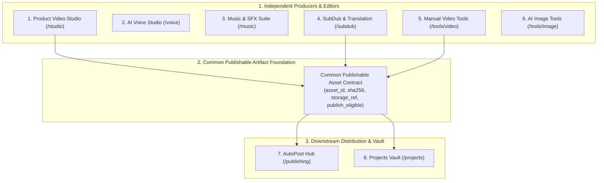

# Web App V3 Customer Information Architecture (IA) Specification
> **Task**: `P0.WEBAPP.V3.AUDIT.EXISTING.PRODUCT.REUSE.AUTOPOST.ADDITIVE.FINAL.ALIGNMENT`
> **Program**: `P0.WEBAPP.FULL.PRODUCT.TRUTH.REMEDIATION.V1`
> **Repository**: `manhtoangreensky-wq/toan-aas-standalone`
> **Authoritative Base SHA**: `8873e10f2279aec0fb312b70388b9073ba763f13`
> **Governance**: `OWNER-GOVERNED`, `AUDIT_DOCUMENTATION_ONLY`, `NO_FEATURE_IMPLEMENTATION`

---

## 1. Architectural Principles

The customer information architecture is redesigned to eliminate catalog flattening and align with the real commercial value proposition of TOAN AAS:

1. **Product-Centric Hierarchy (`TARGET_DESIGN`)**: Customers interact with high-level creative and business solutions, not raw technical subroutines.
2. **Distinct Product Family Separation & Engine Reuse (`TARGET_DESIGN`)**:
   - **Voice, Music & SFX, SubDub, and Video Edit** are **completed canonical products reused from Bot Core**; Web App provides authoring UX and bridges directly to existing engines without rebuilding them.
   - **Manual Video Tools (Video Edit)** is a dual-mode engine orchestrating fast local Web-safe FFmpeg tools and canonical background edit jobs via Bot Core.
   - **Product Video** is the **only major video product still requiring full E2E completion** (bridging SQLite `video_jobs` outbox lease/claim & post-delivery billing).
   - **Free Utilities** is a separate lead-magnet product family, not absorbed into Video Edit.
   - **AutoPost (Publishing Automation)** is strictly **additive and optional** (`AUTOPOST_ADDITIVE_ONLY=YES`). All producers function 100% without AutoPost. AutoPost consumes canonical Bot AutoPost APIs; canonical execution authority resides exclusively in `manhtoangreensky-wq/bot`.
3. **Progressive Disclosure (`TARGET_DESIGN`)**: Primary sidebar provides immediate access to the 10 core product homes. Secondary discovery (tool drawers, format presets, niche calculators) is housed cleanly within product hubs.

---

## 2. Customer Navigation Architecture (13-Item Canonical Sidebar)

The customer sidebar is organized into 4 logical tiers totaling 13 canonical items:

```
TIER 1: CREATIVE ENGINES (PRODUCERS & EDITORS)
  1. /studio         - Video Sản Phẩm AI (Product Video Studio)
  2. /voice          - Giọng Nói & Thuyết Minh AI (AI Voice Studio)
  3. /music          - Âm Nhạc & Hiệu Ứng (Music & SFX Suite)
  4. /subdub         - Phụ Đề & Lồng Tiếng Đa Ngữ (SubDub & Translation)
  5. /tools/video    - Công Cụ Video Thủ Công (Manual Video Tools)
  6. /tools/image    - Hình Ảnh & Tài Nguyên Sáng Tạo (AI Image Tools)

TIER 2: ORCHESTRATION & DISTRIBUTION
  7. /publishing     - Xuất Bản Tự Động & Lịch Đăng (AutoPost)

TIER 3: WORKSPACE & ASSETS
  8. /projects       - Dự Án & Thư Viện Media (Projects Vault)
  9. /tools/free     - Tiện Ích Miễn Phí & Quà Tặng (Free Utilities)

TIER 4: COMMERCE & SUPPORT
 10. /pricing        - Bảng Giá & Nâng Cấp (Pricing & Plans)
 11. /wallet         - Ví Tiền & Nạp Xu (Wallet & Top-up)
 12. /account        - Tài Khoản & Bảo Mật (Account Settings)
 13. /support        - Trung Tâm Trợ Giúp (Support & Tickets)
```

---

## 3. Product Family Disposition & Boundary Contracts



### 3.1 Detail by Product Family

#### 1. Product Video (`/studio`) — Flagship Producer (Real Build Required)
- **Current State**: 39 routes in `copyfast_video_studio.py`, 10,215 lines, purely text prompt composition (`INDEPENDENT_SOURCE_VERIFIED`).
- **Completion Status**: `ONLY_MAJOR_VIDEO_PRODUCT_STILL_REQUIRING_FULL_E2E_COMPLETION`. It requires real E2E integration with canonical SQLite `video_jobs` outbox lease/claim and post-delivery wallet billing (`PRODUCT_VIDEO_WEB_E2E_INCOMPLETE=YES`).
- **Target Contract**: Full multi-scene storyboard grid, preflight quote, confirmation modal, job creation in canonical SQLite `video_jobs` outbox, live scene progress polling, and direct HTML5 MP4 player (`TARGET_DESIGN`).
- **Billing Rule**: Wallet charged ONLY after successful final delivery (`FINAL_DELIVERY_REQUIRED_BEFORE_CHARGE=YES`).

#### 2. Voice (`/voice`) — Existing Canonical Engine Integration
- **Engine Authority**: `VOICE = EXISTING_COMPLETED_PRODUCT_TO_REUSE` (`Bot SQLite voice_jobs + existing TTS engine`). No duplicate Voice provider lifecycle in Web (`VOICE_REBUILD_REQUIRED=NO`).
- **Web App Role**: Reuses existing completed Bot Voice engine. Web provides authoring metadata, script composition helpers, direction presets, and authenticated bridge to Bot Core (`TARGET_DESIGN`).

#### 3. Music & SFX (`/music`) — Existing Canonical Engine Integration
- **Engine Authority**: `MUSIC = EXISTING_COMPLETED_PRODUCT_TO_REUSE`. Canonical execution stays with existing Bot Music engine; no duplicate provider submission or billing authority (`MUSIC_REBUILD_REQUIRED=NO`).
- **Web App Role**: Reuses existing completed Bot Music engine. Web provides briefing UX, media selection, progress/status UI, and preview/download (`TARGET_DESIGN`).

#### 4. SubDub & Translation (`/subdub`) — Existing Canonical Engine Integration
- **Engine Authority**: `SUBDUB = EXISTING_COMPLETED_PRODUCT_TO_REUSE`. Bot owns canonical processing, provider/local execution, terminal artifact, and delivery truth (`SUBDUB_REBUILD_REQUIRED=NO`).
- **Web App Role**: Reuses existing completed SubDub processing. Web provides upload/select media UX, mode selection, language/voice/style configuration, transcript editor, progress display, subtitle/video preview, and final result controls (`TARGET_DESIGN`).

#### 5. Manual Video Tools (`/tools/video`) — Dual-Mode Edit Integration
- **Engine Authority**: `VIDEO_EDIT = EXISTING_COMPLETED_PRODUCT_TO_REUSE` (`VIDEO_EDIT_REBUILD_REQUIRED=NO`).
- **Dual-Mode Split**:
  - `LOCAL_WEB_SAFE_OPERATION`: Client/server FFmpeg utility for fast local cuts, crops, compression, and metadata probing.
  - `CANONICAL_VIDEO_EDIT_JOB`: Bridges to existing Bot Video Edit engine for heavy background concatenations and re-encodes.

#### 6. AutoPost (`/publishing`) — Additive Downstream Control Surface
- **Additive Invariant**: `AUTOPOST_ADDITIVE_ONLY=YES`. AutoPost never replaces or becomes mandatory for any producer. All producers (Voice, Music, SubDub, Video Edit, Product Video) work 100% independently without AutoPost (`AUTOPOST_REPLACES_EXISTING_WORKFLOW=NO`, `AUTOPOST_MANDATORY_FOR_PRODUCERS=NO`).
- **Canonical Execution Authority**: `manhtoangreensky-wq/bot` (Bot Foundation PR #1080). Web App does NOT maintain a second ledger, scheduler, or outbox.
- **Web App Capabilities**: Rich UI control surface preserving Web advantages (multi-select asset picking, batch caption editing, side-by-side video aspect preview, clip grids, calendar timeline view, multi-channel status cards, and retry triggers).
- **Result Screen Shortcut**: Optional action on final video screens: `[ 📢 Dùng video này để đăng bài ]`. Creates/opens an AutoPost handoff draft without rerendering, re-editing, redubbing, or recharging. Original producer screen remains open.
- **Primary Video Handoff Sources**: `VIDEO_PRODUCT` (target after completion), `VIDEO_EDIT`, `SUBDUB`, `EXISTING_FINISHED_VIDEO`. Voice and Music are audio products and are not forced into the video handoff contract.
- **Anti-Rerun Policy**: Publishing failure retries only the publication attempt via Bot API; never reruns upstream producers.

#### 7. Free Utilities (`/tools/free`) — Lead Magnets
- **Independence**: Preserved as a distinct customer product family, not absorbed into Video Edit.
- **Target Contract**: Free viral prompt generator, aspect ratio preview calculator, bitrate estimator, and hashtag tools (`TARGET_DESIGN`).

#### 8. Image Tools (`/tools/image`) — Creative Assets
- **Target Contract**: AI product background replacement, thumbnail maker, and sticker generator (`TARGET_DESIGN`).

#### 9. Projects & Media Library (`/projects`) — Unified Vault
- **Target Contract**: Single source of truth for all user-generated media artifacts, version history, and common publishable artifact references (`TARGET_DESIGN`).

#### 10. Account, Wallet & Commerce (`/account`, `/wallet`, `/pricing`) — Commercial Hub
- **Target Contract**: Real PayOS checkout, balance ledger, Telegram account deep-link pairing, and truthful pricing reads via canonical bridge (`INDEPENDENT_SOURCE_VERIFIED`).
