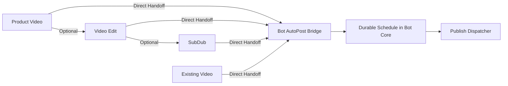

# Web App V3 Product Operating Model & Architectural Truth
> **Task**: `P0.WEBAPP.V3.AUDIT.EXISTING.PRODUCT.REUSE.AUTOPOST.ADDITIVE.FINAL.ALIGNMENT`
> **Program**: `P0.WEBAPP.FULL.PRODUCT.TRUTH.REMEDIATION.V1`
> **Repository**: `manhtoangreensky-wq/toan-aas-standalone`
> **Authoritative Base SHA**: `8873e10f2279aec0fb312b70388b9073ba763f13`
> **Governance**: `OWNER-GOVERNED`, `AUDIT_DOCUMENTATION_ONLY`, `NO_FEATURE_IMPLEMENTATION`

---

## 1. Executive Summary & Source Truth Alignment

Following the live deployment of `V2-07` on production VPS (`tg.toanaas.vn`), a rigorous independent source code audit and runtime verification was conducted across the Web App codebase (`toan-aas-standalone`), Telegram Bot core (`bot`), and live systemd services.

The audit establishes the following empirical and architectural truths:

1. **`copyfast_video_studio.py` is Strictly Planning-Only (`INDEPENDENT_SOURCE_VERIFIED`)**:
   - Exact source measurements on Base SHA `8873e10f2279aec0fb312b70388b9073ba763f13`:
     - Total Lines: `10,215`
     - HTTP Decorator Routes: `39` (not 37)
     - Implementation Nature: Purely prompt composition and static scene planning (`PLANNING_ONLY=YES`).
     - Gaps: Zero job creation, zero provider calls, zero MP4 outputs, zero delivery receipts, and zero interaction with the SQLite wallet table.
2. **Canonical Worker Execution Architecture (`INDEPENDENT_SOURCE_VERIFIED`)**:
   - Current production execution uses:
     - SQLite `video_jobs`
     - `video_dispatch_outbox`
     - Lease/claim semantics via `services/remote_worker_api.py` and `remote_worker.py`
     - Endpoints: `POST /api/v1/worker/claim`, `POST /api/v1/worker/complete`, `POST /api/v1/worker/fail`
     - Workers are systemd-managed daemon processes on Ubuntu VPS.
     - **Celery and Redis Queue are NOT used** (`CELERY_CURRENTLY_USED=NO`, `REDIS_QUEUE_CURRENTLY_USED=NO`). P0-D integrates Web jobs with this existing canonical contract.
3. **Product Video Billing Contract (`INDEPENDENT_SOURCE_VERIFIED`)**:
   - Preflight / Quote calculation may occur before dispatch.
   - Customer wallet charge occurs **ONLY after successful final delivery** and canonical charge decision (`FINAL_DELIVERY_REQUIRED_BEFORE_CHARGE=YES`).
   - Failed or recovered jobs incur zero charge (`FAILED_NO_CHARGE=0_XU`, `RECOVERY_NO_CHARGE=0_XU`). Pre-render debit or pre-render debit-then-refund models are strictly unverified and prohibited.
4. **Three Distinct Runtime Connectivity Categories (`READ_ONLY_RUNTIME_VERIFIED`)**:
   - `DEPLOY_RESTART_NGINX_502`: Infrastructure gateway outage during CI/CD auto-deploy `systemctl restart toanaas-web.service` (1-3s socket drop).
   - `BOT_CORE_ROUTE_MISSING`: Upstream Bot Core 127.0.0.1:8080 lacks `/internal/v1/admin/*` endpoints (returns upstream 404; Web bridge wraps into HTTP 200 guarded envelope). Not an Nginx 502.
   - `ACCOUNT_TELEGRAM_UNLINKED`: Application state 409 when user lacks linked Telegram ID. Not a gateway failure.
5. **Nginx Upstream Retry & Zero-Downtime Policy (`TARGET_DESIGN`)**:
   - Safe upstream retry is permitted ONLY for idempotent read requests (GET/HEAD with `error timeout http_502`).
   - `MUTATION_HTTP_RETRY_POLICY=NO_BLIND_REPLAY`: Financial, job creation, and state mutation POST requests must NOT be blindly replayed by Nginx. Replaying POST requests risks duplicating business side effects.
   - Principle: `HTTP_RETRY != BUSINESS_OPERATION_RETRY`. Mutation retry is permitted exclusively through endpoint-level proven idempotency semantics.
   - Zero-Downtime Target: Candidate solutions (graceful reload, socket handoff, multi-worker rolling replacement, upstream overlap, health-aware deployment) are evaluated in task P0-B1.
6. **Pricing & Packages Invariant (`INDEPENDENT_SOURCE_VERIFIED`)**:
   - Public routes `/api/v1/pricing` and `/api/v1/packages` use canonical bridge reads.
   - Invariant: `NO_LOCAL_EFFECTIVE_PRICING`, `NO_CLIENT_DERIVED_PRICING`, `NO_STATIC_EFFECTIVE_PRICE_FALLBACK`.
   - If bridge is unreachable, the system renders a truthful unavailable/guarded state; it never fabricates fallback prices.
7. **Single AutoPost Business Authority (`INDEPENDENT_SOURCE_VERIFIED`)**:
   - `AUTOPOST_CANONICAL_EXECUTION_AUTHORITY = manhtoangreensky-wq/bot`.
   - Web App must NOT maintain a second authoritative handoff registry, publication ledger, scheduler, outbox, platform receipt store, or idempotency store.
   - Bot Core owns the durable core: `PublishableAsset` canonical resolution, `HandoffReceipt`, `PublicationDraft` state, `publication`, `publication_attempt`, `schedule`, `outbox`, `receipt`, `claim/lease`, `idempotency`, `publish-only retry`, transport adapters, and platform receipt reconciliation.
   - Web App acts exclusively as the control surface and read projection, preserving its UX strengths (multi-select, batch actions, parallel status views, side-by-side preview, clip grids, calendar view, multi-channel view, admin monitoring).
   - Cross-repo contract: `Web -> authenticated internal AutoPost API/bridge -> Bot AutoPost Core -> SQLite Outbox -> platform adapter`.
8. **Owner Product Truth: Existing Engine Reuse & Additive AutoPost (`INDEPENDENT_SOURCE_VERIFIED`)**:
   - `VOICE_ENGINE = EXISTING_CANONICAL_CAPABILITY` (Rebuild required: NO; Web integrates authoring UX & bridge).
   - `MUSIC_ENGINE = EXISTING_CANONICAL_CAPABILITY` (Rebuild required: NO; Web integrates briefing & preview UX).
   - `SUBDUB_ENGINE = EXISTING_CANONICAL_CAPABILITY` (Rebuild required: NO; Web integrates transcript editor & preview).
   - `VIDEO_EDIT_ENGINE = EXISTING_CANONICAL_CAPABILITY` (Rebuild required: NO; Dual-mode: Web-safe local FFmpeg + Bot edit engine).
   - `PRODUCT_VIDEO_WEB_E2E = INCOMPLETE` (`ONLY_MAJOR_VIDEO_PRODUCT_STILL_REQUIRING_FULL_E2E_COMPLETION`).
   - Current Web modules for Voice, Music, SubDub are authoring metadata and script helpers only; completed execution engines remain in Bot Core. Web work is `INTEGRATE, EXPOSE, VERIFY, POLISH`, not `REBUILD_ENGINE`.
   - `AUTOPOST_ADDITIVE_ONLY = YES`: AutoPost is strictly additive and optional. All producers work independently without AutoPost. Removing or disabling AutoPost leaves existing producer workflows 100% operational.

---

## 2. The 10 Customer Product Families & Independence Contracts

Web App V3 groups all customer capabilities into **10 Distinct, Independent Product Families**:

```
[1. PRODUCT_VIDEO]                -> AI Product Video Studio (Multi-scene, E2E Render)
[2. VOICE]                        -> AI Voice & Speech Synthesis (TTS, Clone)
[3. MUSIC_AND_SFX]                -> Commercial Music & Foley SFX (BGM, Cue Sheets)
[4. SUBTITLE_DUBBING_TRANSLATION] -> Subtitles, Multilingual Dubbing & Burn-in
[5. VIDEO_EDIT]                   -> Manual Fast Video Tools (Trim, Crop, Merge, FFmpeg)
[6. PUBLISHING_AUTOMATION]        -> AutoPost (Scheduling, Multi-channel Orchestration)
[7. FREE_TOOLS]                   -> Free Utility Suite & Viral Prompts (Lead Magnets)
[8. IMAGE_TOOLS]                  -> AI Product Photography & Creative Visuals
[9. PROJECTS_MEDIA_LIBRARY]       -> Media Vault, Asset Storage & Version History
[10. ACCOUNT_WALLET_COMMERCE]     -> PayOS Topup, Balance Ledger, Telegram Pairing
```

### Independence, Engine Reuse & Non-Blocking Architecture (`TARGET_DESIGN`)
- **Voice Engine Reuse**: `VOICE = EXISTING_COMPLETED_PRODUCT_TO_REUSE`. Web App reuses the existing canonical Voice capability (`Bot SQLite voice_jobs + existing TTS engine`). Web provides authoring metadata, script helpers, and direction UX; it does NOT create a second Voice provider lifecycle in Web (`VOICE_REBUILD_REQUIRED=NO`).
- **Music & SFX Engine Reuse**: `MUSIC = EXISTING_COMPLETED_PRODUCT_TO_REUSE`. Web App reuses the existing canonical Music/SFX engine. Web owns briefing UX, media selection, progress/status UI, and preview/download (`MUSIC_REBUILD_REQUIRED=NO`). Canonical execution stays with existing Bot engine; no duplicate provider submission or billing authority.
- **SubDub Engine Reuse**: `SUBDUB = EXISTING_COMPLETED_PRODUCT_TO_REUSE`. Web App reuses existing canonical SubDub processing. Web owns upload/select media UX, mode selection, language/voice/style config, transcript editor, progress display, subtitle/video preview, and final result controls (`SUBDUB_REBUILD_REQUIRED=NO`). Bot owns canonical processing, provider/local execution, terminal artifact, and delivery/job truth.
- **Video Edit Dual-Mode Reuse**: `VIDEO_EDIT = EXISTING_COMPLETED_PRODUCT_TO_REUSE`. Reuses both existing Web-safe local FFmpeg tooling (`LOCAL_WEB_SAFE_OPERATION`) and existing canonical Bot Video Edit engine (`CANONICAL_VIDEO_EDIT_JOB`) for heavy background jobs. One unified customer-facing Video Edit product orchestrates both (`VIDEO_EDIT_REBUILD_REQUIRED=NO`).
- **Product Video E2E Completion Required**: `PRODUCT_VIDEO = ONLY_MAJOR_VIDEO_PRODUCT_STILL_REQUIRING_FULL_E2E_COMPLETION`. Unlike Voice, Music, SubDub, and Video Edit, Product Video in Web is strictly planning-only (39 routes, 10,215 lines, zero job creation, zero worker dispatch, zero MP4 outputs). Task P0-D bridges canonical SQLite `video_jobs` outbox lease/claim and post-delivery billing contracts (`PRODUCT_VIDEO_WEB_E2E_INCOMPLETE=YES`).
- **Free Tools Separation**: Free Utilities is a distinct lead-magnet family, not merged into Video Edit.
- **AutoPost is Additive Only**: `AUTOPOST_ADDITIVE_ONLY=YES`. AutoPost is strictly an additional capability downstream of media generation. AutoPost must **NEVER** replace or become mandatory for any producer:
  - Voice works 100% without AutoPost.
  - Music works 100% without AutoPost.
  - SubDub works 100% without AutoPost.
  - Video Edit works 100% without AutoPost.
  - Product Video works 100% without AutoPost.
  - Disabling or removing AutoPost leaves all producer generation, preview, download, and storage workflows fully operational (`AUTOPOST_REPLACES_EXISTING_WORKFLOW=NO`, `AUTOPOST_MANDATORY_FOR_PRODUCERS=NO`).

---

## 3. Product Video Studio: Gap Analysis & Target Pipeline

### 3.1 Gap Matrix (25 Lifecycle Points)
Comparing `copyfast_video_studio.py` against Telegram Bot core:

| Lifecycle Step | Telegram Bot Runtime | Web App Source (`copyfast_video_studio.py`) | Evidence Level & Status |
| :--- | :--- | :--- | :--- |
| **01. Brief & Prompt** | Interactive Telegram prompts | 39 decorator routes, text-only prompts | `INDEPENDENT_SOURCE_VERIFIED` (PARTIAL) |
| **02. Asset Upload** | Photo/video upload via TG media | Reference URLs only; no vault storage | `INDEPENDENT_SOURCE_VERIFIED` (MISSING) |
| **03. Scene Composition** | Script decomposition via LLM | Static templates in Python code | `INDEPENDENT_SOURCE_VERIFIED` (MISSING) |
| **04. Storyboard Order** | Sequential script array | In-memory array in browser DOM | `INDEPENDENT_SOURCE_VERIFIED` (PARTIAL) |
| **05. Preflight Quote** | Real-time quote before dispatch | Deterministic mock estimate endpoint | `INDEPENDENT_SOURCE_VERIFIED` (PARTIAL) |
| **06. Confirmation** | 2-step invoice confirmation | None (stops at text planning) | `INDEPENDENT_SOURCE_VERIFIED` (MISSING) |
| **07. Job Creation** | Atomic insert in SQLite `video_jobs` | Zero job records created | `INDEPENDENT_SOURCE_VERIFIED` (MISSING) |
| **08. Worker Dispatch** | `video_dispatch_outbox` lease/claim | None (zero worker invocation) | `INDEPENDENT_SOURCE_VERIFIED` (MISSING) |
| **09. Execution Monitoring**| Polling scene progress | Mock event log | `INDEPENDENT_SOURCE_VERIFIED` (MISSING) |
| **10. Final Stitching** | FFmpeg scene + audio assembly | None | `INDEPENDENT_SOURCE_VERIFIED` (MISSING) |
| **11. Video Preview** | Video message in TG chat | None | `INDEPENDENT_SOURCE_VERIFIED` (MISSING) |
| **12. Delivery Receipt** | Durable delivery receipt in DB | None | `INDEPENDENT_SOURCE_VERIFIED` (MISSING) |
| **13. Wallet Charge** | Charged ONLY after delivery | None (no wallet interaction) | `INDEPENDENT_SOURCE_VERIFIED` (MISSING) |

---

## 4. Manual Video Tools (Video Edit): Operational Model (`TARGET_DESIGN`)

`VIDEO_EDIT` provides direct, high-speed, local/server media processing without generative AI model latency or cost.

### 4.1 Scope of Operations
- **Trimming & Cutting**: Precise timestamp-based cut/trim without re-encoding (`-c copy`) where keyframes align.
- **Concatenation & Merging**: Stitching multiple clips with matching codecs.
- **Cropping & Aspect Resizing**: Padding or cropping to 9:16, 16:9, 1:1, 4:5.
- **Compression**: Web-optimized H.264/AAC compression.
- **Audio Manipulation**: Mute, audio replacement, audio extraction (MP4 $\rightarrow$ MP3/WAV).
- **Watermark & Branding**: Overlay transparent PNG logos at fixed anchor positions.
- **Thumbnail & Poster**: Extraction of specific high-resolution frames.
- **Speed Ramping**: 0.5x to 2.0x video playback adjustments.
- **Metadata Inspection**: Media probe (duration, bitrate, dimensions, codec, audio channels).

### 4.2 Local vs Job Execution Boundary (`TARGET_DESIGN`)
- `LOCAL_SAFE_OPERATION`: Client-side WebAssembly / lightweight server FFmpeg stream processing for instant tasks (trim < 60s, extract audio, probe metadata).
- `CANONICAL_JOB_REQUIRED`: Complex re-encoding, large batch concatenations, or high-bitrate exports create background jobs in the Media Vault queue.
- **Cost Invariant**: Cheap FFmpeg tasks must NEVER be routed through paid AI provider APIs.

---

## 5. AutoPost & Common Publishable Artifact Architecture

### 5.1 Single AutoPost Business Authority & Execution Boundaries (`TARGET_DESIGN`)

```
AUTOPOST_CANONICAL_EXECUTION_AUTHORITY = manhtoangreensky-wq/bot
```

AutoPost's single canonical execution authority resides exclusively in **Bot Core (`manhtoangreensky-wq/bot`)**.

The Web App acts strictly as a **control surface and read projection**. Web App must **NOT** maintain a second authoritative:
- handoff registry
- publication ledger
- scheduler
- outbox
- platform receipt store
- idempotency store

#### External Dependency Recording
- **`BOT_REPOSITORY`**: `manhtoangreensky-wq/bot`
- **`CURRENT_AUTOPOST_FOUNDATION_PR`**: `1080`
- **`CURRENT_REMOTE_PR_HEAD`**: `556989ccc0ae6e28d11d2aaacfe11f4cbb06a914`
- **`CURRENT_STATUS`**: `OPEN / NOT_MERGED / AUTHORITY_CLOSURE_IN_PROGRESS`
- **Dependency Invariant**: Web V3 masterplan explicitly depends on this Bot PR/program for the canonical AutoPost core. Bot AutoPost is NOT marked as merged or complete; it is an open in-flight foundation PR. The Web repository must NOT mutate the Bot repository.

#### Ownership & Responsibilities
```
[WHAT BOT CORE OWNS (CANONICAL EXECUTION AUTHORITY)]
- PublishableAsset canonical resolution & validation
- HandoffReceipt generation & ledger
- PublicationDraft state machine
- publication & publication_attempt records
- schedule table & claim/lease polling
- SQLite publishing outbox & lease worker
- platform receipt reconciliation (post_id, platform_url)
- Idempotency key registry & deduplication
- Publish-only retry loop (exponential backoff)
- Channel transport adapters (TikTok, YouTube Shorts, FB Reels)
- Complete publication audit log

[WHAT WEB APP OWNS (CONTROL SURFACE & READ PROJECTION)]
- Multi-select asset selection & batch queuing
- Rich calendar view with drag-to-reschedule UX
- Side-by-side video aspect preview & clip grids
- Parallel multi-channel publication status views
- Caption template editing & hashtag helpers
- Approval & pause triggers via canonical Bot API
- Manual publish-only retry triggers via Bot API
- Admin publication monitoring read projection

[WHAT AUTPOST NEVER OWNS]
- Product Video rendering (owned by Product Video Studio)
- Video Edit trimming/cropping (owned by Video Edit Tools)
- Subtitle transcription or audio dubbing (owned by SubDub Engine)
```

#### Cross-Repository Execution Pipeline
```
+-------------------------------------------------------------------------+
| WEB APP (Control Surface & Read Projection)                             |
| - Asset Multi-Select Grid   - Calendar Schedule Matrix                  |
| - Side-by-Side Preview      - Draft Form & Channel Selectors            |
+-------------------------------------------------------------------------+
                                    |
                    Authenticated Internal Bridge
                    POST /internal/v1/autopost/handoff
                    POST /internal/v1/autopost/schedule
                    POST /internal/v1/autopost/retry
                                    v
+-------------------------------------------------------------------------+
| BOT AUTOPOST CORE (Canonical Authority: manhtoangreensky-wq/bot)        |
| - PublishableAsset Resolution     - HandoffReceipt Store                |
| - PublicationDraft State Machine  - Idempotency Registry                |
| - SQLite Publishing Outbox        - Lease / Claim Scheduler             |
+-------------------------------------------------------------------------+
                                    |
                               Lease / Claim
                                    v
+-------------------------------------------------------------------------+
| PLATFORM ADAPTERS & WORKERS (TikTok, YouTube, Facebook)                 |
| - Transport Dispatch             - Platform Error Mapping               |
| - Platform Receipt Binding       - Publish-Only Retry Loop              |
+-------------------------------------------------------------------------+
```

### 5.2 Additive-Only AutoPost Contract & Result Screen Shortcut (`TARGET_DESIGN`)

```
AUTOPOST_ADDITIVE_ONLY = YES
AUTOPOST_REPLACES_EXISTING_WORKFLOW = NO
AUTOPOST_MANDATORY_FOR_PRODUCERS = NO
```

AutoPost is strictly an **additive optional distribution feature**. It never replaces, intercepts, or mandates changes to core producer execution:
1. **Producer Self-Sufficiency**:
   - Voice works 100% without AutoPost.
   - Music & SFX works 100% without AutoPost.
   - SubDub works 100% without AutoPost.
   - Video Edit works 100% without AutoPost.
   - Product Video works 100% without AutoPost.
   - Removing, disabling, or taking AutoPost offline leaves all producer workflows (prompting, preview, generation, downloads, history, billing receipts) completely intact and functional.
2. **Result Screen Shortcut**:
   - On the final result screen of every eligible video producer (`Product Video`, `Video Edit`, `SubDub`, `Existing Finished Video`), an optional secondary action is presented:
     ```
     [ 📢 Dùng video này để đăng bài ]
     ```
   - Clicking this shortcut opens a pre-filled AutoPost handoff draft modal or routes to `/publishing` with the `asset_id` populated.
   - **Non-Destructive Invariants**:
     - `NO_RERENDER`: Never triggers a new video render.
     - `NO_REPROCESS`: Never invokes FFmpeg or video re-encoding.
     - `NO_REDUB`: Never re-runs transcription or audio dubbing.
     - `NO_RECHARGE`: Never deducts additional wallet Xu for opening or preparing the draft.
     - `NO_SCREEN_REPLACEMENT`: The original producer result screen remains open, fully functional, and accessible with its native download, playback, and version history buttons intact.
   - `AUTOPOST_ACTION = ADDITIONAL_OPTION`, strictly NOT `NEW_MANDATORY_TERMINAL_STATE`.
3. **Producer Separation (Video vs Audio)**:
   - Primary video handoffs to AutoPost are: `VIDEO_PRODUCT`, `VIDEO_EDIT`, `SUBDUB`, `EXISTING_FINISHED_VIDEO`.
   - `VOICE` and `MUSIC_AND_SFX` are audio products; they are **NOT** forced into the video handoff contract. They remain independent audio producers that export MP3/WAV, usable standalone or within future composition workflows.

### 5.3 Producer Independence & Common Publishable Artifact Contract (`TARGET_DESIGN`)

All video generation and editing tools produce media independently and expose finished artifacts to Bot handoff:
- **`VIDEO_PRODUCT`**: Produces multi-scene rendered MP4 $\rightarrow$ hands off artifact (Target after Product Video completion).
- **`VIDEO_EDIT`**: Produces trimmed, cropped, or merged MP4 $\rightarrow$ hands off artifact.
- **`SUBDUB`**: Produces subtitled or multilingual dubbed MP4 $\rightarrow$ hands off artifact.
- **`EXISTING_FINISHED_VIDEO`**: Vault or uploaded MP4 $\rightarrow$ hands off artifact.

Any producer handing off media to AutoPost must conform to this immutable contract. Raw user-entered Job IDs are strictly prohibited as handoff authority:

```json
{
  "asset_id": "ast_01j8x8m9k2a4b7c1d3e5f6g7h8",
  "owner_id": "usr_99182",
  "source_product": "PRODUCT_VIDEO | VIDEO_EDIT | SUBDUB | EXISTING_FINISHED_VIDEO",
  "source_job_id": "job_01j8x8m9... | null",
  "parent_asset_id": "ast_01j8x000... | null",
  "artifact_sha256": "e3b0c44298fc1c149afbf4c8996fb92427ae41e4649b934ca495991b7852b855",
  "media_type": "video/mp4",
  "duration_ms": 32400,
  "width": 1080,
  "height": 1920,
  "artifact_state": "READY",
  "processing_completed_at": "2026-09-19T10:15:00Z",
  "caption_candidate": "Trải nghiệm dưỡng trắng chuyên sâu cùng Tinh Chất ToanAAS #skincare #beauty",
  "canonical_storage_ref": "vault://videos/2026/09/ast_01j8x8m9.mp4",
  "publish_eligible": true,
  "publish_blockers": []
}
```

### 5.4 Multi-Step Processing Model (Optional DAG/Recipe) & Anti-Rerun Rule (`DESIGN_PROPOSAL`)

The publishing workflow supports an optional pipeline recipe. Chaining is strictly optional; there is no mandatory Product $\rightarrow$ Edit $\rightarrow$ SubDub pipeline:



> [!IMPORTANT]
> **Anti-Rerun Rule (Publish-Only Retry)**: Retrying a failed publication attempt must **NEVER rerun a completed upstream producer**. If a YouTube Shorts upload fails with a network timeout, only the publication attempt is retried through the Bot AutoPost retry API; the upstream video render remains untouched and is not re-billed.

### 5.5 Durable Publishing Core & State Machine (`TARGET_DESIGN`)
Bot Core Entities: `publication`, `publication_attempt`, `schedule`, `outbox`, `receipt`.

Lifecycle States in Bot Core:
```
[PLANNED] -> [APPROVED] -> [SCHEDULED] -> [CLAIMED/DISPATCHING]
   |             |              |                    |
   v             v              v                    v
[CANCELLED]  [CANCELLED]   [CANCELLED]      [PLATFORM_PROCESSING]
                                                     |
                                        +------------+------------+
                                        |                         |
                                        v                         v
                                   [PUBLISHED]           [FAILED_RETRYABLE]
                                        |                         |
                               (Receipt Recorded)         (Retry Counter < Max)
                                                                  |
                                                                  v
                                                            [FAILED_FINAL]
```

- **Invariant**: `HTTP_200 != PUBLISHED`. A post is only considered published when a verified platform receipt identifier is bound and recorded by Bot Core.
- **Idempotency**: Every publication attempt carries a unique idempotency key based on `(publication_id, channel_id, scheduled_time)`.

### 5.6 Video Split / Batch Contract (`DESIGN_PROPOSAL`)
For workflows converting one long master video into multiple short social posts:
- Structure: **Parent Batch** managing $N$ **Child Publication Units**.
- Each child independently owns: clip asset, aspect preview, caption, approval status, target channel, scheduled slot, platform receipt, and retry state.
- **Fault Isolation**: Failure of Child Clip #3 does not affect, pause, or duplicate Child Clips #1, #2, or #4.
- **Web UI Role**: Web App renders clip grids, batch caption editing, multi-select channel toggling, and calendar timeline placement, dispatching batch creation requests to the canonical Bot AutoPost API.
