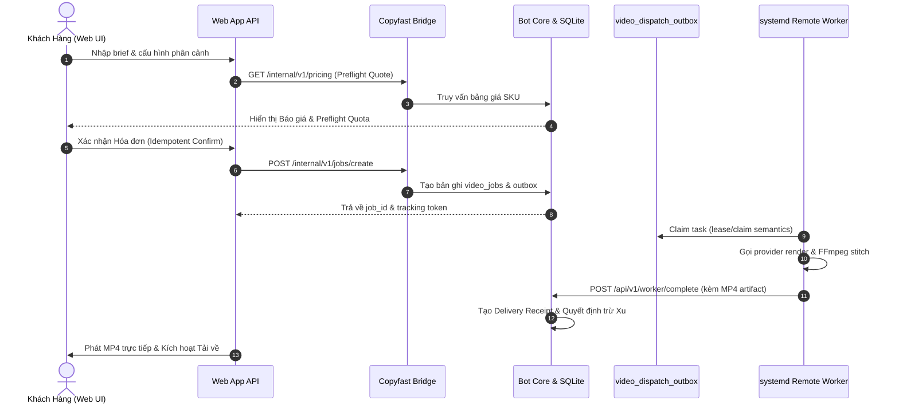
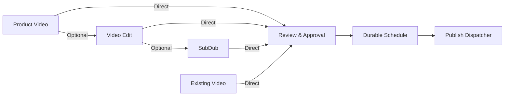

# Web App V3 Product Operating Model & Architectural Truth
> **Task**: `P0.WEBAPP.V3.AUDIT.CANONICAL.ARCHITECTURE.TRUTH.CLOSURE`
> **Program**: `P0.WEBAPP.FULL.PRODUCT.TRUTH.REMEDIATION.V1`
> **Repository**: `manhtoangreensky-wq/toan-aas-standalone`
> **Authoritative Base SHA**: `8873e10f2279aec0fb312b70388b9073ba763f13`
> **Governance**: `OWNER-GOVERNED`, `AUDIT_DOCUMENTATION_ONLY`, `NO_FEATURE_IMPLEMENTATION`

---

## 1. Executive Summary & Source Truth Alignment

Following the live deployment of `V2-07` on production VPS (`tg.toanaas.vn`), a rigorous independent source code audit and runtime verification was conducted across the Web App codebase (`toan-aas-standalone`), Telegram Bot core (`bot`), and live systemd services.

The audit establishes the following empirical and architectural truths:

1. **`copyfast_video_studio.py` is Strictly Planning-Only (`INDEPENDENT_SOURCE_VERIFIED`)**:
   - Exact source measurements on Base SHA `8873e10f2279aec0fb312b70388b9073ba763f13`:
     - Total Lines: `10,215`
     - HTTP Decorator Routes: `39` (not 37)
     - Implementation Nature: Purely prompt composition and static scene planning (`PLANNING_ONLY=YES`).
     - Gaps: Zero job creation, zero provider calls, zero MP4 outputs, zero delivery receipts, and zero interaction with the SQLite wallet table.
2. **Canonical Worker Execution Architecture (`INDEPENDENT_SOURCE_VERIFIED`)**:
   - Current production execution uses:
     - SQLite `video_jobs`
     - `video_dispatch_outbox`
     - Lease/claim semantics via `services/remote_worker_api.py` and `remote_worker.py`
     - Endpoints: `POST /api/v1/worker/claim`, `POST /api/v1/worker/complete`, `POST /api/v1/worker/fail`
     - Workers are systemd-managed daemon processes on Ubuntu VPS.
     - **Celery and Redis Queue are NOT used** (`CELERY_CURRENTLY_USED=NO`, `REDIS_QUEUE_CURRENTLY_USED=NO`). P0-D must integrate Web jobs with this existing canonical contract.
3. **Product Video Billing Contract (`INDEPENDENT_SOURCE_VERIFIED`)**:
   - Preflight / Quote calculation may occur before dispatch.
   - Customer wallet charge occurs **ONLY after successful final delivery** and canonical charge decision (`FINAL_DELIVERY_REQUIRED_BEFORE_CHARGE=YES`).
   - Failed or recovered jobs incur zero charge (`FAILED_NO_CHARGE=0_XU`, `RECOVERY_NO_CHARGE=0_XU`). Pre-render debit or pre-render debit-then-refund models are strictly unverified and prohibited.
4. **Three Distinct Runtime Connectivity Categories (`READ_ONLY_RUNTIME_VERIFIED`)**:
   - `DEPLOY_RESTART_NGINX_502`: Infrastructure gateway outage during CI/CD auto-deploy `systemctl restart toanaas-web.service` (1-3s socket drop).
   - `BOT_CORE_ROUTE_MISSING`: Upstream Bot Core 127.0.0.1:8080 lacks `/internal/v1/admin/*` endpoints (returns upstream 404; Web bridge wraps into HTTP 200 guarded envelope). Not an Nginx 502.
   - `ACCOUNT_TELEGRAM_UNLINKED`: Application state 409 when user lacks linked Telegram ID. Not a gateway failure.
5. **Pricing & Packages Invariant (`INDEPENDENT_SOURCE_VERIFIED`)**:
   - Public routes `/api/v1/pricing` and `/api/v1/packages` use canonical bridge reads.
   - Invariant: `NO_LOCAL_EFFECTIVE_PRICING`, `NO_CLIENT_DERIVED_PRICING`, `NO_STATIC_EFFECTIVE_PRICE_FALLBACK`.
   - If bridge is unreachable, the system renders a truthful unavailable/guarded state; it never fabricates fallback prices.

---

## 2. The 10 Customer Product Families

Instead of exposing an uncurated flat catalog of 135 technical subroutines, Web App V3 groups all customer capabilities into **10 Distinct Product Families**:

```
[1. PRODUCT_VIDEO]                -> AI Product Video Studio (Multi-scene, E2E Render)
[2. VOICE]                        -> AI Voice & Speech Synthesis (TTS, Clone)
[3. MUSIC_AND_SFX]                -> Commercial Music & Foley SFX (BGM, Cue Sheets)
[4. SUBTITLE_DUBBING_TRANSLATION] -> Subtitles, Multilingual Dubbing & Burn-in
[5. VIDEO_EDIT]                   -> Manual Fast Video Tools (Trim, Crop, Merge)
[6. PUBLISHING_AUTOMATION]        -> AutoPost (Scheduling, Multi-channel Orchestration)
[7. FREE_TOOLS]                   -> Free Utility Suite & Viral Prompts (Lead Magnets)
[8. IMAGE_TOOLS]                  -> AI Product Photography & Creative Visuals
[9. PROJECTS_MEDIA_LIBRARY]       -> Media Vault, Asset Storage & Version History
[10. ACCOUNT_WALLET_COMMERCE]     -> PayOS Topup, Balance Ledger, Telegram Pairing
```

### Boundary & Independence Rules (`TARGET_DESIGN`)
- **Music & SFX** is strictly separated from **Subtitle/Dubbing/Translation**. They are distinct product engines with separate commercial models, toolsets, and lifecycles.
- Product families are independent: building Voice, Music, or SubDub does NOT depend on Product Video completion.

---

## 3. Product Video Studio: Gap Analysis & Target Pipeline

### 3.1 Gap Matrix (25 Lifecycle Points)
Comparing `copyfast_video_studio.py` against Telegram Bot core:

| Lifecycle Step | Telegram Bot Runtime | Web App Source (`copyfast_video_studio.py`) | Evidence Level & Status |
| :--- | :--- | :--- | :--- |
| **01. Brief & Prompt** | Interactive Telegram prompts | 39 decorator routes, text-only prompts | `INDEPENDENT_SOURCE_VERIFIED` (PARTIAL) |
| **02. Asset Upload** | Photo/video upload via TG media | Reference URLs only; no vault storage | `INDEPENDENT_SOURCE_VERIFIED` (MISSING) |
| **03. Scene Composition** | Script decomposition via LLM | Static templates in Python code | `INDEPENDENT_SOURCE_VERIFIED` (MISSING) |
| **04. Storyboard Order** | Sequential script array | In-memory array in browser DOM | `INDEPENDENT_SOURCE_VERIFIED` (PARTIAL) |
| **05. Preflight Quote** | Real-time quote before dispatch | Deterministic mock estimate endpoint | `INDEPENDENT_SOURCE_VERIFIED` (PARTIAL) |
| **06. Confirmation** | 2-step invoice confirmation | None (stops at text planning) | `INDEPENDENT_SOURCE_VERIFIED` (MISSING) |
| **07. Job Creation** | Atomic insert in SQLite `video_jobs` | Zero job records created | `INDEPENDENT_SOURCE_VERIFIED` (MISSING) |
| **08. Worker Dispatch** | `video_dispatch_outbox` lease/claim | None (zero worker invocation) | `INDEPENDENT_SOURCE_VERIFIED` (MISSING) |
| **09. Execution Monitoring**| Polling scene progress | Mock event log | `INDEPENDENT_SOURCE_VERIFIED` (MISSING) |
| **10. Final Stitching** | FFmpeg scene + audio assembly | None | `INDEPENDENT_SOURCE_VERIFIED` (MISSING) |
| **11. Video Preview** | Video message in TG chat | None | `INDEPENDENT_SOURCE_VERIFIED` (MISSING) |
| **12. Delivery Receipt** | Durable delivery receipt in DB | None | `INDEPENDENT_SOURCE_VERIFIED` (MISSING) |
| **13. Wallet Charge** | Charged ONLY after delivery | None (no wallet interaction) | `INDEPENDENT_SOURCE_VERIFIED` (MISSING) |

### 3.2 Canonical Target Pipeline (`TARGET_DESIGN`)



---

## 4. AutoPost & Publishing Automation Architecture

### 4.1 System Role & Ownership Boundaries (`TARGET_DESIGN`)
AutoPost is an **orchestrator downstream of asset generation**. It consumes finished media artifacts and handles their review, scheduling, dispatch, and delivery receipts.

```
[WHAT AUTPOST OWNS]
- Multi-channel orchestration (TikTok, YouTube Shorts, Facebook Reels)
- Preview & approval workflows
- Durable schedule persistence across server restarts
- Channel-specific adapter dispatch & rate limiting
- Platform receipt binding (post_id, platform_url)
- Publish-only retry loop (with exponential backoff)
- Complete publication audit log

[WHAT AUTPOST DOES NOT OWN]
- Product Video rendering (owned by Product Video Studio)
- Video Edit trimming/cropping (owned by Video Edit Tools)
- Subtitle transcription or audio dubbing (owned by SubDub Engine)
```

### 4.2 Common Publishable Artifact Contract (`TARGET_DESIGN`)
Any producer handing off media to AutoPost must conform to this immutable design contract. User-entered raw Job IDs are strictly prohibited as handoff authority:

```json
{
  "asset_id": "ast_01j8x8m9k2a4b7c1d3e5f6g7h8",
  "owner_id": "usr_99182",
  "source_product": "PRODUCT_VIDEO | VIDEO_EDIT | SUBDUB | EXISTING_FINISHED_VIDEO",
  "source_job_id": "job_01j8x8m9... | null",
  "parent_asset_id": "ast_01j8x000... | null",
  "artifact_sha256": "e3b0c44298fc1c149afbf4c8996fb92427ae41e4649b934ca495991b7852b855",
  "media_type": "video/mp4",
  "duration_ms": 32400,
  "width": 1080,
  "height": 1920,
  "artifact_state": "READY",
  "processing_completed_at": "2026-09-19T10:15:00Z",
  "caption_candidate": "Trải nghiệm dưỡng trắng chuyên sâu cùng Tinh Chất ToanAAS #skincare #beauty",
  "canonical_storage_ref": "vault://videos/2026/09/ast_01j8x8m9.mp4",
  "publish_eligible": true,
  "publish_blockers": []
}
```

### 4.3 Multi-Step Processing Model (Optional DAG/Recipe) (`DESIGN_PROPOSAL`)
The publishing workflow supports an optional pipeline recipe. Chaining is strictly optional; there is no mandatory Product $\rightarrow$ Edit $\rightarrow$ SubDub pipeline:



**Anti-Rerun Rule**: Retrying a failed publication step must **NEVER rerun a completed producer**. If YouTube upload fails with a network timeout, only the publication attempt is retried; the upstream video render remains untouched.

### 4.4 Durable Publishing Core & State Machine (`TARGET_DESIGN`)
Entities: `publication`, `publication_attempt`, `schedule`, `outbox`, `receipt`.

Lifecycle States:
```
[PLANNED] -> [APPROVED] -> [SCHEDULED] -> [CLAIMED/DISPATCHING]
   |             |              |                    |
   v             v              v                    v
[CANCELLED]  [CANCELLED]   [CANCELLED]      [PLATFORM_PROCESSING]
                                                     |
                                        +------------+------------+
                                        |                         |
                                        v                         v
                                   [PUBLISHED]           [FAILED_RETRYABLE]
                                        |                         |
                               (Receipt Recorded)         (Retry Counter < Max)
                                                                  |
                                                                  v
                                                            [FAILED_FINAL]
```

- **Invariant**: `HTTP_200 != PUBLISHED`. A post is only considered published when a verified platform receipt identifier is bound and recorded.
- **Idempotency**: Every publication attempt carries a unique idempotency key based on `(publication_id, channel_id, scheduled_time)`.

### 4.5 Video Split / Batch Contract (`DESIGN_PROPOSAL`)
For workflows converting one long master video into multiple short social posts:
- Structure: **Parent Batch** managing $N$ **Child Publication Units**.
- Each child independently owns: clip asset, aspect preview, caption, approval status, target channel, scheduled slot, platform receipt, and retry state.
- **Fault Isolation**: Failure of Child Clip #3 does not affect, pause, or duplicate Child Clips #1, #2, or #4.

---

## 5. Web Platform Advantages over Telegram Bot

| Dimension | Telegram Bot Runtime | Web App Studio Target |
| :--- | :--- | :--- |
| **Workspace Viewport** | Narrow chat bubble (360–420px) | Full widescreen canvas (1280–1920px) |
| **Scene Visibility** | One message at a time; lost in scroll history | Multi-scene storyboard grid visible simultaneously |
| **Ordering & Timing** | Text commands or clunky inline button pagination | Direct drag-and-drop scene reordering with timeline strip |
| **Bulk Editing** | Edit scene by scene individually | Bulk parameter updates (aspect ratio, style, speaker across all scenes) |
| **File Delivery** | Bounded by Telegram 50MB Bot API upload limit | Direct streaming & high-bitrate file delivery |
