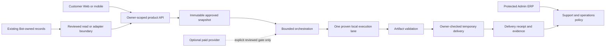

# Post-UI/UX Media Orchestration and Service Evidence Research Triage

**Status:** Deferred architecture and service-operations research. This record
does not authorize a runtime, provider, billing, Bot or deployment change.

**Applies to:** a future Web-native customer workspace, customer mobile
companion and separately protected Admin ERP.

**Does not apply to:** changing `bot.py`, copying Telegram callbacks or
conversation state into the Web/App, enabling a provider, changing PayOS/Xu,
or performing a production deployment.

## Why this record exists

The owner supplied three complementary research papers about chat-operated
video editing, a shared semantic master for subtitle/dubbing work, and a
local-first multi-scene product-video architecture. They contain useful
principles, but they describe more capability than the current Web/App should
adopt at once.

This record selects only the principles that can make a Web/App product more
truthful, supportable and resumable after UI/UX acceptance. It deliberately
rejects copying a Telegram flow, importing an infrastructure stack by name, or
claiming a media outcome before there is a validated artifact.

The companion decision records are:

- [`POST_UI_UX_PRODUCT_SERVICE_RESEARCH_TRIAGE.md`](POST_UI_UX_PRODUCT_SERVICE_RESEARCH_TRIAGE.md)
  for product, customer and service boundaries; and
- [`POST_UI_UX_MEDIA_PLATFORM_RESEARCH_TRIAGE.md`](POST_UI_UX_MEDIA_PLATFORM_RESEARCH_TRIAGE.md)
  for media-stage invariants and rollout gates.

| Owner-supplied research input | Selectively retained here | Deliberately not copied |
| --- | --- | --- |
| Chat-operated video-editing architecture | bounded local lane, artifact validation, durable evidence and delivery-first truth | Telegram callback/backstack and chat-state implementation |
| Shared Semantic Master DAG | original-timeline offsets, stable segment IDs, one translation master and separate subtitle/dub copies | four independent pipelines or a universal quality constant |
| Local editing and multi-scene production architecture | immutable approval, normalized composition and restart-safe stage decisions | provider-first execution or premature queue/platform infrastructure |

## Start condition and authority boundary

No item below starts until the current customer and Admin ERP UI/UX phase is
accepted by the product owner with the relevant desktop/mobile verification
evidence recorded in its merged UI/UX PRs. The first executable follow-up also
requires one named Web-native capability, a fixture-only test plan and a
written authority matrix.

Existing Bot-owned identity, wallet/Xu, PayOS, provider and historical job
records remain unchanged. A future Web-native namespace, if approved, must
have its own explicit owner for identity binding, assets, job lifecycle,
delivery, receipts, settlement and support evidence. The Web/App is never a
second mutable Bot ledger or webhook owner.

The diagram is a target decision boundary, not a claim that these services
already exist.

## Principles selected for later adoption

| Principle | Retained because | Earliest safe application |
| --- | --- | --- |
| Platform-neutral product contract | Web, mobile and an optional Bot adapter can consume the same product facts without sharing UI/session state. | One approved Web-native capability. |
| Immutable approved snapshot | Refresh, retry or worker recovery cannot change the assets, scene order, output policy or prompt that was confirmed. | A capability with an explicit confirm step. |
| One deterministic local lane first | A bounded local operation is simpler to prove, observe and roll back than a broad provider-first rewrite. | A legal fixture-backed file operation. |
| Durable stage manifests and idempotency | Each side effect can be diagnosed and a duplicate confirm/recovery can return the original outcome. | Jobs that outlive a request or restart. |
| Delivery-first evidence | `completed` is allowed only after validation and owner-deliverable output; a receipt records what actually happened, including a no-cost outcome. | Every public async media lane. |
| Shared semantic master only for real fan-out | One source/translation master avoids drift when subtitle, translation, dub and combo outputs genuinely share media semantics. | Fixture-only shadow/replay V2 work. |
| Profile-driven quality | Subtitle and audio constraints are language and destination dependent; quality is not one global CPS or LUFS number. | A named subtitle/dub profile. |
| Evidence-led support resolution | Support can explain and safely recover a job from immutable facts rather than changing a customer job state by hand. | The first long-running Web-native lane. |

## Media and lifecycle invariants

These are testable constraints, not implementation instructions:

1. Intake records a content fingerprint and validates media before it becomes a
   job input. For media output, inspection and full decode are distinct
   validation gates.
2. A confirmed snapshot is immutable. Every stage records its input fingerprint,
   output fingerprint, runtime revision, attempt and idempotency key.
3. A job lifecycle is monotonic: `draft`, `reviewed`, `confirmed`, `queued`,
   `processing`, `validated`, `delivered`, `receipted`. `settled` is an
   optional later branch only when a separately authorized canonical settlement
   authority records it; a local/no-cost job can truthfully end at
   `receipted`. Guarded, failed, cancelled and waiting-review states remain
   truthful and visible.
4. A retry may safely poll, retrieve or continue a saved accepted external task.
   It must not silently create a new paid ASR, translation, TTS, render or
   provider task.
5. In a subtitle/translation/dub fan-out, VAD may guide processing but all
   offsets stay on the original timeline. A high-quality audio master remains
   separate from a provider-specific ASR derivative.
6. A semantic source master and one translation master keep stable
   `segment_id` values. Readable subtitle adaptation and speakable dub-script
   adaptation are distinct derivatives; one final mux combines the approved
   artifacts.
7. Multi-scene composition normalizes each accepted artifact to one output
   profile before concat or transition. An incomplete or ambiguous scene cannot
   create a final success claim.
8. Delivery checks ownership at the time a temporary URL or download action is
   created. Storage paths, provider handles and permanent URLs are never
   customer-facing data.

## Evidence-led support and resolution contract

Support is a product capability, not a hidden mutable override. A future
support view may read a redacted evidence bundle containing:

- approved snapshot hash and capability version;
- stage timeline, input/output fingerprints and validation report;
- recovery/duplicate-suppression decision, actor and reason;
- owner-scoped delivery receipt and expiry state; and
- settlement or refund authority reference, without exposing a second ledger.

The only safe workflow is:

`intake -> ownership check -> evidence collection -> bounded recovery decision
-> truthful customer update -> audit closure`

The support role cannot mint artifacts, alter a historical approval, view
another customer's private output, reveal provider handles or make a financial
write outside the canonical authority. A recovery action must be CSRF-protected,
permission-checked, idempotent where applicable and auditable.

## Explicitly deferred or rejected

- Copying Telegram backstack/callbacks, a Bot job clone or a second payment
  webhook into the Web/App.
- Kafka, Kubernetes, WebRTC, GStreamer or a generic DAG engine before a
  measured need proves that the smallest reviewed lane is insufficient.
- Four independent ASR/translation/dubbing pipelines, VAD that rebases source
  timing, or one fixed subtitle/audio quality constant for all outputs.
- A browser-visible provider token, raw FFmpeg command, local path, storage
  key or permanent artifact URL.
- A paid-provider automatic resubmission, completion before validated delivery,
  fake progress/output, or a manual support action that silently changes
  receipt/settlement truth.
- A desktop editing timeline or Admin ERP duplicated into the mobile companion.

## Post-UI/UX decision order

1. **Authority and readiness audit.** Publish the owner matrix, feature flags,
   storage policy, retention/deletion policy and legal fixture boundary for one
   selected capability.
2. **One truthful local lane.** Implement one bounded operation with approved
   snapshot, real fixture output, validation, owner-only delivery and receipt.
3. **Evidence and recovery.** Add stage manifests, duplicate/recovery decisions,
   redacted support evidence and tests for restart/delivery ambiguity.
4. **Semantic DAG shadow mode.** Only where media really fans out, produce
   source/translation masters and QC reports from fixtures or approved retained
   artifacts. Provider calls and settlement remain disabled.
5. **Durable orchestration.** Add a lease/checkpoint only when a demonstrated
   job duration or recovery case requires it.
6. **Provider/commercial adapter.** Design it last, with saved task recovery,
   signature/replay checks, cost guard and delivery-first accounting. Release
   is a separate owner-approved decision.

## Required proof before a capability is public

- Legal fixtures prove duplicate confirmation, restart checkpoints, invalid
  output, cross-account access, expired delivery and receipt deduplication.
- A customer-visible status maps to a durable evidence state; no wording
  implies a provider action or delivery that has not happened.
- Support fixtures prove redaction, immutable history, permitted recovery and
  no side-effect retry.
- Provider calls, PayOS/wallet mutations and production webhooks remain off
  during design, fixture and shadow/replay milestones.
- The implementation has a small rollback path and an explicit safe-off flag.

## Open decisions for the future capability design

1. Retention, deletion, legal-hold and regional requirements by source-media,
   artifact, transcript and support-evidence class.
2. Canonical authority for settlement/refund when a Web-native namespace is
   introduced without duplicating Bot-owned records.
3. Customer-facing SLA, delayed/guarded/failure wording and escalation policy.
4. The first bounded capability that offers clear customer value without
   starting a broad media-engine rewrite.
5. Measured thresholds that justify a queue, real-time status transport or
   provider adapter over the smallest reviewed local boundary.

## Relationship to the current UI/UX phase

This record is intentionally parked. It preserves the architecture research so
the next product phase can make deliberate decisions after UI/UX acceptance;
it does not interrupt the ongoing visual-system work or authorize runtime
changes today.
