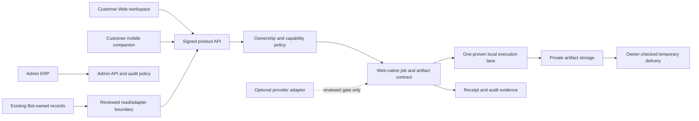

# Post-UI/UX Web/App Product & Service Research Triage

**Status:** Deferred product-and-runtime research. This is a decision record,
not implementation authorization.

**Applies to:** the standalone TOAN AAS customer Web App, a future customer
mobile companion, and the separately protected internal Admin ERP.

**Does not apply to:** changing `bot.py`, copying Telegram callbacks/state into
the Web UI, running a provider, changing PayOS/wallet behavior, or making a
production deployment.

## Start condition

Do not start any item in this document until the current UI/UX phase is
accepted for all of the following:

- customer workspace on desktop and mobile;
- customer account, job and asset flows;
- internal Admin ERP on its separately protected route; and
- the shared teal/cyan design, motion, accessibility and responsive behavior.

An accepted screen alone is not enough. The first post-UI/UX implementation
must also have a named Web-native capability, an ownership decision and a
fixture-only test plan. This keeps research from silently becoming a broad
runtime rewrite.

## Research inputs and decision method

This record synthesizes the three owner-supplied research papers:

- *Kiến trúc và mô hình vận hành cho sản phẩm chỉnh sửa video tích hợp vào
  chat-bot*;
- *Quy trình tốt nhất cho TOAN AAS là "Shared Semantic Master DAG"*;
- *Kiến trúc sản xuất cho Local Video Editing và Product Video nhiều cảnh*.

They are research inputs, not a source-code contract. The detailed media
invariants remain in
[`POST_UI_UX_MEDIA_PLATFORM_RESEARCH_TRIAGE.md`](POST_UI_UX_MEDIA_PLATFORM_RESEARCH_TRIAGE.md).
This companion record covers the wider product, service and Web/App boundary.

Each proposal must pass all six questions below before it can be adopted:

1. Does it create a real, understandable customer or operator outcome?
2. Is one service the clear authority for identity, job state, asset access,
   billing and support evidence?
3. Can it fail truthfully, resume safely and avoid duplicate side effects?
4. Can the Web/App explain its status without exposing a secret, internal path
   or provider handle?
5. Can it be proven with legal fixtures, operational evidence and a rollback?
6. Is it simpler than the current design for the problem that actually exists?

Failure on any question means the proposal remains deferred, guarded or
rejected. A new framework or provider is never an objective by itself.

## Current boundary and target direction

The current reviewed production boundary stays in force: the Bot is canonical
for its existing identity, wallet/Xu, PayOS, provider and historical job
records. The Web App must not create a second mutable ledger, webhook or copy
of those records.

The future direction is not a Telegram-shaped Web page. It is a
platform-neutral product surface: customer Web is the rich workspace, mobile
is a companion for capture/upload, status and simple approval, and Admin ERP
is an internal control surface. They can share a signed, owner-scoped product
API without sharing UI state or browser secrets.

The diagram is a target boundary, not a statement that each service already
exists. A future Web-native job namespace can be considered only after an
authority matrix explicitly assigns identity, assets, state, delivery, billing
and support. Existing Bot records remain unchanged.

## Decisions retained for later adoption

| Decision | Why it is useful | First safe application |
| --- | --- | --- |
| Platform-neutral product contract | Web, mobile and an optional Bot adapter can use one job/asset/status model instead of copying callbacks or local browser state. | A single reviewed Web-native capability after the authority matrix is approved. |
| Immutable approved snapshot | A confirmed job cannot change scene order, source asset, prompt, output profile or policy after a browser refresh/retry. | First executable job with a confirmation step. |
| Truthful lifecycle | A product may say `completed` only after its promised artifact is validated and owner-deliverable. | Every asynchronous Web-native lane. |
| Artifact lineage and durable stage state | Input/output fingerprints, runtime revision, status and receipt evidence support diagnosis, recovery and customer support. | Long-running jobs that may outlive a request. |
| Private owner-checked storage policy | Asset bytes stay private; the server grants a short-lived delivery action only after owner/lifecycle checks. | Any upload, import or generated output. |
| Shared semantic master where one source feeds multiple media outputs | One source transcript and translation master reduce drift and duplicate ASR/translation work; subtitle copy and dub copy remain separate derivatives. | Subtitle/translate/dub work in shadow or replay mode only. |
| Evidence-led support resolution | Immutable stage, validation and delivery facts let support diagnose/recover truthfully without changing a customer job or ledger by hand. | The first long-running Web-native lane, after role/redaction rules are reviewed. |
| Admin ERP as a separate operational surface | Customer work and internal decisions have different permissions, audit needs and navigation density. | Continue current `/admin`-family hardening without merging it into customer routes. |
| Evidence-led rollout | Fixtures, shadow/replay, canary and rollback prevent a UI claim from outrunning a proven engine. | Every new runtime or provider lane. |

## Decisions that require evidence before selection

| Candidate | Decision rule |
| --- | --- |
| FFmpeg local execution | Keep it as the default candidate for deterministic file operations, but publish a capability only after the deployed build, allow-listed inputs, real fixture output and validation policy prove it. [`ffprobe`](https://ffmpeg.org/ffprobe.html) supports machine-readable inspection; it does not by itself prove an output is deliverable. |
| Queue, lease and durable checkpoints | Start with the smallest reviewed job boundary. Introduce durable queueing/leases only when jobs outlive requests, recovery or concurrent workers are demonstrably needed. Do not add Kafka merely for future scale. |
| Object storage implementation | Select managed S3-compatible storage only after retention, region, cost, encryption and incident ownership are recorded. Delivery URLs must be short lived and owner-checked; a presigned URL is bearer-style access for its validity period. [AWS guidance](https://docs.aws.amazon.com/AmazonS3/latest/userguide/using-presigned-url.html) documents its expiration model. |
| SSE, WebSocket or polling | Decide from actual reconnect behavior, mobile background limits, job duration and expected fan-out. The customer contract is monotonic status, not a particular transport. |
| Semantic DAG | Use it only when source media genuinely fans out to subtitle, translation, dubbing or combo outputs. A simple one-off local operation does not need a generalized DAG. |
| Provider adapter | Require explicit confirmation, saved external task ID, signature/replay checks, cost guard, terminal-state policy and recovery that polls/retrieves the saved task rather than blindly resubmitting it. |
| Mobile feature scope | Start with capture, upload, notifications, status and simple review. Complex timeline, dense ERP work and multi-panel review stay Web-first until a mobile study proves otherwise. |
| Local/no-cost pricing | Preserve the safety rule that settlement never happens before valid delivery, but do not copy a `0 Xu` price or refund policy from the Bot without a product decision. |

## Explicitly not adopted

- Copying Telegram callback namespaces, backstack or chat state into Web/App.
- A second Web-owned PayOS webhook, Xu ledger or mutable clone of Bot records.
- Browser access to provider credentials, FFmpeg commands, storage paths or
  permanent file URLs.
- Fake progress, fake output or a `completed` state before validation.
- Automatic replacement submission for an accepted paid provider task,
  including an ambiguous `ACCEPTANCE_UNKNOWN` outcome.
- Four independent ASR/translation/dubbing pipelines when one compatible source
  master can be reused.
- Global subtitle-reading-speed, loudness, codec or timing constants for every
  language and delivery target.
- Kafka, Kubernetes, WebRTC or GStreamer as a default architecture. Each has a
  different operating cost and must answer a measured need first.
- A desktop-style video timeline or Admin ERP copied wholesale to mobile.

## Service roadmap after UI/UX acceptance

This is an ordered decision backlog, not a delivery promise. One capability is
selected, implemented, reviewed and measured before the next one begins.

### 0. Capability and authority gate

Inventory the current Web-native modules, flags, storage topology and bridge
boundary. Publish an authority/state map for the chosen capability and decide
whether it reads existing Bot records, owns a new isolated namespace, or stays
guarded. Do not begin if the ownership answer is ambiguous.

### 1. One truthful local service lane

Choose the smallest useful, low-risk operation already represented in the
product. Build an approved snapshot, allow-listed intake, bounded execution,
artifact validation, owner-only temporary delivery and a receipt that says
exactly what happened. Use legal fixtures; provider calls, PayOS mutations and
Bot changes remain off.

### 2. Job, asset and recovery contract

Add durable stage state only for that proven lane. Its contract must show a
monotonic lifecycle such as:

`draft -> reviewed -> confirmed -> queued -> processing -> validated -> delivered -> receipted`

`settled` is an optional later branch only when a separately authorized
canonical settlement authority records it. A local/no-cost job can truthfully
remain terminal at `receipted`; Web UI or support work never manufactures a
financial mutation.

`failed`, `guarded`, `cancelled` and `waiting_review` are truthful terminal or
review states; no state may regress after a durable terminal decision. Duplicate
confirmation, retry, delivery and settlement must be harmless.

### 3. Shared media knowledge where it pays for itself

For subtitle, translation, dubbing and combo work, introduce the source
semantic master and translation master in shadow/replay first. Preserve
timeline offsets, stable segment IDs and the distinction between readable
subtitle copy and speakable dub copy. Apply language/output profiles and
publish QC warnings rather than asserting certainty the engine cannot prove.

### 4. Rich Web workspace and service operations

Connect the accepted runtime contract to the existing customer workspace:
asset library, review, job center, support context and saved evidence. Keep
Admin ERP separately role-protected for readiness, failures, recovery review,
customer support and audit. UI labels must describe the real state, not a
future provider capability.

Support follows an evidence-led resolution path rather than a mutable job
override: ownership check, redacted immutable evidence, bounded recovery
decision, truthful customer update and audit closure. An internal action never
creates a second wallet, receipt or historical-job authority.

### 5. Mobile companion

Reuse the signed, owner-scoped API for capture/upload, notifications, job
status and lightweight review. It must not receive broader access than the
customer Web session, and it must not expose internal admin operations.

### 6. Provider and commercial adapters last

Only after the local lane is observable and recovery-safe may a provider or
commercial adapter be designed. The order is: sandbox/fixtures, signed
callback or poll deduplication, saved external task recovery, cost guard,
delivery evidence, then controlled rollout. It never creates a new production
PayOS webhook or duplicates settlement authority.

## Security, privacy and quality gates

Future implementation PRs must translate research into testable rules:

- Authenticate and authorize every upload, read, delivery and support lookup;
  never trust a browser-supplied owner, role, path or content type.
- Apply allow-listed file types, generated storage names, size limits, content
  inspection and storage outside the Web root, consistent with the
  [OWASP File Upload Cheat Sheet](https://cheatsheetseries.owasp.org/cheatsheets/File_Upload_Cheat_Sheet.html).
- Validate artifact container/streams/profile/duration and decode policy before
  delivery; file existence is insufficient.
- Persist audit evidence for approval, stage transition, validation, delivery,
  duplicate suppression and any settlement decision.
- Restrict support evidence by role, customer ownership and retention policy;
  use short-lived access for private artifacts and redact provider handles,
  storage paths and secrets.
- Verify ownership again when creating a temporary delivery URL; expiry reduces
  exposure but does not replace authorization.
- Exercise duplicate confirmation, restart/recovery, invalid output,
  cross-account access, expired delivery and provider-callback replay with
  fixtures before a capability becomes public.
- Keep feature flags safe/off by default and treat live provider, payment and
  deployment promotion as separately approved release work.

## Remaining research questions

These questions must be answered per capability rather than assumed globally:

1. What retention, deletion and legal-review rules apply to customer source
   media, generated artifacts, transcripts and support evidence?
2. Which Vietnamese-first language, subtitle and audio profiles produce useful
   results for the chosen customer segment and delivery platform?
3. Which observable threshold justifies a worker queue, real-time transport or
   service split instead of the simpler existing boundary?
4. What customer-facing estimate, cancellation and support wording remains
   truthful when an execution is delayed, guarded or needs review?
5. What provider data-processing, regional, pricing and retry guarantees are
   acceptable before any paid adapter is enabled?
6. What support SLA wording, evidence retention/legal-hold policy and
   settlement/refund authority are appropriate for a Web-native capability?

## Relationship to the UI/UX phase

The current priority remains UI/UX: clean teal/cyan customer and Admin ERP
surfaces, precise alignment, accessible responsive behavior and meaningful
motion. This document is deliberately parked until that work is accepted. It
preserves the research so later product work starts from a reasoned, testable
architecture rather than from a copied Telegram flow or a speculative stack.
