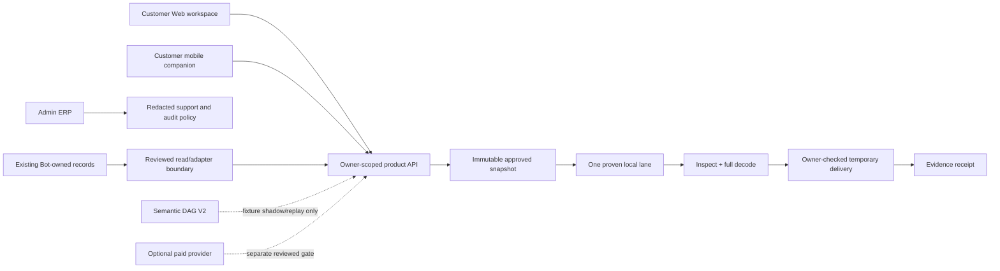

# Sổ quyết định nghiên cứu hậu UI/UX — Media Product & Service

**Trạng thái:** Tài liệu nghiên cứu đã được sàng lọc. Không phải là quyền mở
runtime, provider, payment, Bot, webhook hay deploy.

**Thứ tự bắt buộc:** Hoàn tất và nghiệm thu UI/UX customer + Admin ERP trên
desktop/mobile trước; sau đó chọn **một** capability Web-native, có owner
matrix và fixture-only plan. Không dùng nghiên cứu này để mở rộng phạm vi của
PR UI hiện tại.

## Nguồn đã đọc và cách sử dụng

Ba tài liệu do product owner cung cấp là đầu vào kiến thức:

1. *Kiến trúc và mô hình vận hành cho sản phẩm chỉnh sửa video tích hợp vào
   chat-bot*;
2. *Quy trình tốt nhất cho TOAN AAS là “Shared Semantic Master DAG”*; và
3. *Kiến trúc sản xuất cho Local Video Editing và Product Video nhiều cảnh*.

Chúng được đối chiếu với các decision record hiện có:

- [`POST_UI_UX_MEDIA_ORCHESTRATION_RESEARCH_TRIAGE.md`](POST_UI_UX_MEDIA_ORCHESTRATION_RESEARCH_TRIAGE.md)
- [`POST_UI_UX_MEDIA_PLATFORM_RESEARCH_TRIAGE.md`](POST_UI_UX_MEDIA_PLATFORM_RESEARCH_TRIAGE.md)
- [`POST_UI_UX_PRODUCT_SERVICE_RESEARCH_TRIAGE.md`](POST_UI_UX_PRODUCT_SERVICE_RESEARCH_TRIAGE.md)

Nguyên tắc quyết định: chỉ nhận một đề xuất khi nó tạo ra kết quả thật cho
khách hàng hoặc vận hành, có authority rõ, fail/retry trung thực, có fixture
và rollback; không nhận một stack hay một flow chỉ vì nó “trông đầy đủ”.

## Quyết định đã sàng lọc

| Đầu vào nghiên cứu | Quyết định | Lý do và điều kiện áp dụng |
| --- | --- | --- |
| Một `approved snapshot` bất biến, lifecycle monotonic và evidence/receipt sau delivery | **Nhận sau UI/UX** | Đây là contract trung lập nền tảng: refresh, retry hoặc restart không được đổi asset, scene, output policy hay quyết định đã xác nhận. `completed` chỉ có sau validation và owner-checked delivery. |
| Local deterministic media lane, allow-list, `ffprobe` + full decode | **Nhận cho lane đầu tiên** | Một output nhỏ, có fixture thật, dễ chứng minh hơn provider-first hoặc một “studio” rộng. Không tạo engine thứ hai; chỉ dùng runtime Web-native đã được chứng minh. |
| `EditPlan` versioned, một mapping công khai → một operation thực thi đã biết | **Nhận cho lane đầu tiên** | Snapshot phải ghi asset fingerprint, preset/operation allow-list, output profile, output policy và version. Không có execution mapping thì capability giữ `guarded`; không được hiển thị như đã chạy. |
| Shared Semantic Master, Translation Master, `segment_id` ổn định và offset theo timeline gốc | **Pilot sau local lane** | Có giá trị khi cùng một nguồn thực sự fan-out sang subtitle, dịch, dub hoặc combo. Pilot chỉ ở fixture/approved-artifact shadow/replay, không public route, provider, settlement hoặc delivery. |
| Subtitle copy tách dub copy; profile theo ngôn ngữ/đích xuất; QC có ngữ cảnh | **Nhận như invariant V2** | Tránh dịch lặp, drift giữa subtitle/dub, VAD làm lệch timestamp và “một CPS/LUFS dùng cho mọi ngôn ngữ”. Chưa có nghĩa là công khai hứa chất lượng engine chưa kiểm chứng. |
| Per-stage idempotency, durable manifest và exclusive recovery lease | **Điều kiện** | Chỉ thêm khi job thật sự dài hơn request hoặc cần restart/concurrency recovery. Mọi confirm/delivery/receipt trùng lặp phải trả lại outcome cũ, không tạo side effect mới. |
| Queue, Redis/RabbitMQ, object storage, real-time transport | **Defer theo số liệu** | Chỉ chọn sau authority, retention, chi phí, load và recovery evidence. Không cài Kafka/Kubernetes/WebRTC/GStreamer chỉ để “đủ kiến trúc”. |
| Provider adapter, paid job, webhook/poll recovery | **Defer cuối cùng** | Cần user confirmation, saved external task ID, signature/replay guard, monotonic terminal state, cost guard và recovery chỉ poll/retrieve task đã chấp nhận. Không auto resubmit khi `ACCEPTANCE_UNKNOWN`. |
| Telegram callback/backstack, raw Telegram ID, Bot Xu/PayOS/webhook hoặc historical job clone | **Từ chối cho Web/App** | Giữ abstract product facts, không copy UI state hay tạo ledger/webhook authority thứ hai. Bot-owned identity, Xu, PayOS, provider và historical records tiếp tục đứng riêng. |

## Architecture boundary sau khi UI/UX được nghiệm thu

Đây là target boundary, không phải xác nhận rằng các service đã tồn tại.

## Candidate nhỏ nhất để bắt đầu sau UI/UX

Candidate ưu tiên là **một export MP4 một nguồn với preset cố định**, ví dụ
reframe asset riêng tư sang `9:16` bằng scale/pad bounded. Chỉ chọn candidate
này nếu capability tương đương đã có trong Web-native allow-list; nếu không,
chọn operation single-input gần nhất đã được chứng minh thay vì tạo renderer
mới để biện minh cho roadmap.

Lane này không có scene ordering, transition/audio mixing, provider, payment,
Bot bridge hay ledger mới. Tuy vậy, nó vẫn chứng minh được toàn bộ contract:

1. Intake owner-checked và fingerprint đầu vào;
2. Review/confirm tạo approved snapshot;
3. Execution allow-listed với fixture thật;
4. `ffprobe` **và** full decode trước delivery;
5. Download tạm thời kiểm tra owner lần nữa; và
6. Receipt trung thực, không suy ra hay copy chính sách `0 Xu` từ Bot.

Lane đầu tiên chỉ nhận asset đã qua owner check. Không mở URL import tuỳ ý cho
đến khi có policy SSRF, redirect, egress, content type, quota và retention
được review riêng.

## Addendum contract — Web-native execution và Semantic DAG V2

Các chi tiết dưới đây được rút ra từ ba nguồn nghiên cứu để dùng **sau** khi
UI/UX được nghiệm thu. Chúng khóa điều kiện chấp nhận được; không bật một
runtime, route hay provider mới trong PR UI hiện tại.

### 1. `EditPlan` Web-native cho lane chạy thật đầu tiên

Mỗi control public phải biên dịch một-một sang operation allow-listed. Bản
`EditPlan` đã xác nhận cần tối thiểu có `job_id`, owner, input asset
fingerprint, operation/preset version, expected output profile, output policy,
config hash và confirmation receipt. Retry hay refresh phải quay lại cùng
snapshot; nếu mapping không tồn tại, trạng thái là `guarded`, không phải
`completed` giả.

Receipt Web là evidence riêng: artifact attestation, thời điểm tạo delivery
tạm thời, owner check tại thời điểm download và receipt dedupe. Nó không dùng
Telegram acknowledgment, raw path/object key, permanent URL, Xu, PayOS hay
lịch sử Bot làm authority.

### 2. Semantic DAG V2 cho Subtitle, Translation và Dubbing

Pilot chỉ dùng fixture/shadow replay. `ApprovedSnapshot` cần khóa lane, ngôn
ngữ nguồn/đích, subtitle/audio profile, voice policy, glossary version,
runtime/config hash và confirmation receipt. `SourceSemanticMaster` giữ
`segment_id` ổn định cùng timestamp của video gốc; VAD chỉ tối ưu batching,
tuyệt đối không co timeline. Thứ tự transcript là timed subtitle do khách tải
lên, embedded subtitle đã kiểm tra, rồi mới tới ASR; trạng thái alignment phải
trung thực là `word_aligned`, `segment_timed` hoặc `alignment_unavailable`.

Chỉ tạo một `TranslationMaster`, sau đó sinh `subtitle_copy` và `dub_copy`
riêng. Hai copy cùng lineage ngữ nghĩa nhưng không buộc trùng câu chữ.
Profile theo ngôn ngữ/đích xuất quyết định CPL, CPS, số dòng, duration, gap,
loudness và true peak; không dùng một hằng số chung cho mọi ngôn ngữ hoặc
nền tảng. Diarization chỉ được bật khi cần speaker label hoặc voice casting,
và audio master dùng để mix phải tách với input ASR mono/16 kHz.

Với lane dub/combo, M&E phải có provenance theo thứ tự: khách cung cấp →
embedded đã kiểm tra → source separation → voice-over/ducking. Source
separation không được coi là M&E sạch. AV QC phải kiểm tra vocal bleed, music
damage, phasing, missing ambience và pumping; không đạt hoặc không chắc chắn
phải là `WAITING_REVIEW`/`FAIL`, không phải `PASS`.

Stage manifest dùng các trạng thái `PENDING`, `RUNNING`, `PASS`, `FAIL`,
`WAITING_REVIEW`, `CANCELLED`, kèm input/output fingerprints, attempt,
runtime/provider version, timestamps và external task ID chỉ cho Admin. Khóa
idempotency là `job + stage + segment + config_hash`: confirm hay recovery lặp
trả lại outcome cũ. Nếu duration dubbing lệch lớn hoặc validation không đạt,
job dừng ở `WAITING_REVIEW`/`FAIL`; không time-stretch quá mức để báo thành
công giả.

### 3. Evidence gate trước bất kỳ public execution nào

Một capability chỉ được mở sau khi fixture chứng minh được:

1. duplicate confirm, retry và recovery không tạo submit/delivery/receipt
   thứ hai;
2. asset/output lỗi dừng trước delivery; `completed` chỉ sau inspect,
   `ffprobe`, full decode và owner-scoped delivery;
3. cross-account access, temporary URL hết hạn và audit evidence đã redacted
   đều bị chặn đúng;
4. subtitle QC có timestamp tăng dần, không overlap/duration âm, profile
   CPS/CPL/số dòng, line break tự nhiên và low-confidence flag; và
5. combo QC giữ nhất quán về nghĩa, speaker, tên riêng, số/ngày/đơn vị giữa
   subtitle và dub, dù hai copy không cần trùng chữ.

Trong fixture/shadow milestone, provider calls, payment/wallet/Xu mutation,
Bot/webhook mutation đều phải bằng `0`. `ACCEPTANCE_UNKNOWN` là fail-closed:
chỉ poll/retrieve task đã lưu ở future gate, không auto-resubmit paid task.

## PR đầu tiên của Semantic DAG khi đã đủ điều kiện

PR đầu tiên không chạy media. Nó chỉ thêm versioned schema và legal replay
fixture cho `SourceSemanticMaster`, `TranslationMaster`, derivative copy và
stage manifest; test phải chứng minh stable IDs, offsets không đổi, subtitle
và dub tách biệt, lineage/QC đủ và không có side effect. Một PR shadow/replay
riêng chỉ được tính tiếp sau owner review.

## Guardrails không được nới lỏng

- Không đổi `bot.py`, LocalVideoStudio, provider, PayOS/Xu, production webhook
  hay historical Bot records.
- Không expose provider token, raw FFmpeg command, local path, object key hay
  permanent URL cho browser.
- Không fake progress/output; state guarded, failed, cancelled hoặc
  waiting-review phải hiện đúng sự thật.
- Không biến mobile thành desktop timeline hay Admin ERP thu nhỏ; mobile bắt
  đầu từ capture/upload, status, notification và review nhẹ.
- Mỗi capability public phải có safe-off flag, evidence test và rollback path.

## Checklist mở workstream product sau UI/UX

- [ ] UI/UX customer và Admin ERP được owner nghiệm thu trên desktop/mobile.
- [ ] Một capability Web-native có product owner, authority matrix và retention
      policy.
- [ ] Fixture-only test plan bao gồm duplicate confirmation, invalid output,
      cross-account access, expired delivery và receipt dedupe.
- [ ] `EditPlan` mapping/preflight, quota và retention/deletion policy được
      owner review; lane đầu tiên không nhận URL import tuỳ ý.
- [ ] Nếu mở Semantic DAG pilot: stable segment ID, source timeline offsets,
      separate subtitle/dub copy, profile QC và zero-side-effect shadow replay
      đều có fixture evidence.
- [ ] Không có provider/payment/webhook/Bot mutation trong design hoặc fixture
      milestone.
- [ ] Support evidence đã redacted, role-scoped và không có mutable override.
- [ ] Một safe-off flag và rollback decision được ghi trước khi mở public lane.

## Kết luận

Nghiên cứu được giữ lại như một roadmap có điều kiện: xây Web/App thành sản
phẩm media đáng tin cậy và platform-neutral, nhưng khởi đầu bằng một lane nhỏ
chạy thật, có kiểm chứng. Nó không phải chỉ thị copy toàn bộ Bot hay dựng một
hệ microservice trước khi có evidence.
